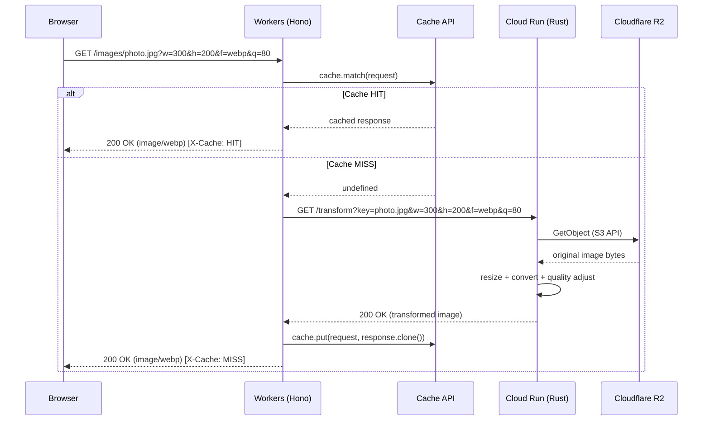

# Image Resize Service

Cloudflare Workers (エッジキャッシュ) + Cloud Run (Rust 画像変換) + R2 (原本ストレージ) による画像リサイズ配信基盤

## アーキテクチャ

```
┌──────────┐         ┌─────────────────────────┐         ┌─────────────────────┐         ┌────────────┐
│          │  GET    │  Cloudflare Workers     │  fetch  │  Cloud Run (Rust)   │ GetObj  │            │
│ Browser  │ ──────→ │  (Hono)                 │ ──────→ │  (Axum)             │ ──────→ │  R2        │
│          │ ←────── │                         │ ←────── │                     │ ←────── │            │
└──────────┘  image  │  ┌───────────────────┐  │  image  │  - リサイズ          │  原本   └────────────┘
                     │  │ Cache API         │  │         │  - フォーマット変換   │
                     │  │ HIT → 即時返却     │  │         │  - 品質調整          │
                     │  │ MISS → origin転送  │  │         └─────────────────────┘
                     │  │ PUT → キャッシュ保存│  │
                     │  └───────────────────┘  │
                     └─────────────────────────┘
```

### リクエストフロー



## 技術スタック

| レイヤー | 技術                      | 役割                                      |
| -------- | ------------------------- | ----------------------------------------- |
| Edge     | Cloudflare Workers + Hono | キャッシュ・ルーティング・アップロード    |
| Origin   | Cloud Run + Rust (Axum)   | 画像変換 (リサイズ / フォーマット / 品質) |
| Storage  | Cloudflare R2             | 原本画像の保存 (S3 互換)                  |
| Client   | React (Vite)              | 動作確認 UI                               |
| IaC      | Pulumi (TypeScript)       | インフラのコード管理                      |
| CI/CD    | GitHub Actions            | 自動テスト・デプロイ                      |

## プロジェクト構成

```
packages/
├── cdn/               # Cloudflare Workers (Hono)
├── image-processor/   # Cloud Run (Rust / Axum)
├── client/            # React Client (Vite)
└── infra/             # Pulumi (TypeScript)
```

## API

### 画像取得

```
GET /images/:key?w=<width>&h=<height>&f=<format>&q=<quality>
```

| パラメータ | 説明         | 例                           |
| ---------- | ------------ | ---------------------------- |
| `w`        | 幅 (px)      | `300`                        |
| `h`        | 高さ (px)    | `200`                        |
| `f`        | フォーマット | `jpg`, `png`, `webp`, `avif` |
| `q`        | 品質 (1-100) | `80`                         |

### 画像アップロード (動作確認用)

```
PUT /images/:key
```

## ドキュメント

- [設計書](docs/DESIGN.md)
