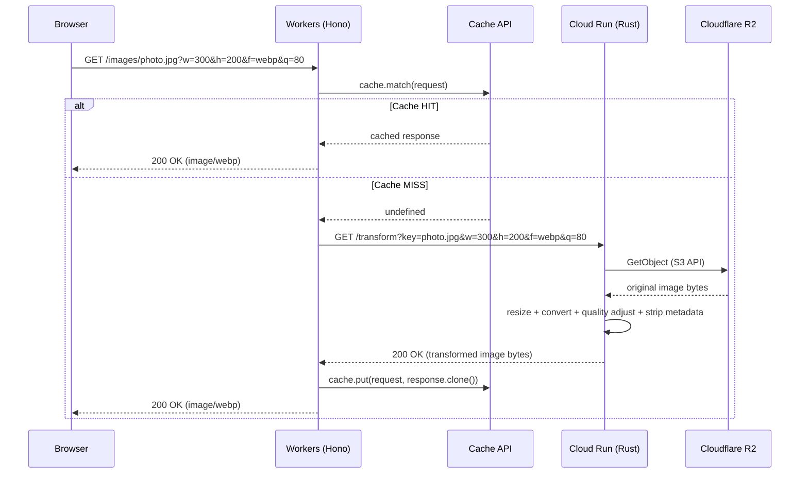

# Image Resize Service 設計書

## 1. システム概要

ブラウザからのリクエストに応じて、R2 に保存された原本画像をリアルタイムにリサイズ・変換して配信するサービス。
Cloudflare Workers のキャッシュレイヤーにより、同一パラメータの 2 回目以降のリクエストはオリジンを経由せず即時返却する。

---

## 2. アーキテクチャ

### 2.1 コンポーネント構成

| コンポーネント        | 技術                      | 役割                                                                             |
| --------------------- | ------------------------- | -------------------------------------------------------------------------------- |
| **Edge (CDN/Cache)**  | Cloudflare Workers + Hono | キャッシュ判定・オリジンへのプロキシ・レスポンスキャッシュ                       |
| **Origin (画像変換)** | Cloud Run + Rust (Axum)   | R2 から原本取得 → リサイズ/フォーマット変換/品質調整/メタデータ削除 → レスポンス |
| **Storage (原本)**    | Cloudflare R2             | 原本画像の保存。S3 互換 API でアクセス                                           |
| **Client (動作確認)** | React (Vite)              | 画像アップロード・リサイズプレビュー                                             |
| **IaC**               | Pulumi (TypeScript)       | R2 バケット・Cloud Run サービスのプロビジョニング                                |

### 2.2 リクエストフロー



### 2.3 ドメイン設計

ベースドメイン: `sendo-app.com`

| サブドメイン            | コンポーネント        | ホスティング       | 用途                                   |
| ----------------------- | --------------------- | ------------------ | -------------------------------------- |
| `image.sendo-app.com`     | Edge (CDN/Cache)      | Cloudflare Workers | 画像配信・アップロードの公開エンドポイント |
| `client.sendo-app.com`  | Client (動作確認)     | Cloudflare Workers | React クライアント (動作確認用 UI)      |

- **Cloud Run**: カスタムドメイン不要。デフォルトの `.run.app` ドメインを使用（Workers からの内部アクセスのみ）
- **R2**: パブリックアクセス不要。S3 互換 API 経由で Cloud Run からのみアクセス

#### DNS レコード

| レコード | ホスト    | 値                           | プロキシ |
| -------- | --------- | ---------------------------- | -------- |
| CNAME    | `img`     | Workers カスタムドメイン設定 | ON (橙)  |
| CNAME    | `client`  | Workers カスタムドメイン設定 | ON (橙)  |

#### キャッシュキー URL

```
https://image.sendo-app.com/images/photo.jpg?f=webp&h=200&q=80&w=300
```

クエリパラメータはアルファベット順にソートされる。

---

## 3. API 設計

### 3.1 Workers (公開エンドポイント)

#### 画像取得

```
GET /images/:key?w=<width>&h=<height>&f=<format>&q=<quality>
```

| パラメータ | 型            | 必須 | デフォルト | 説明                                            |
| ---------- | ------------- | ---- | ---------- | ----------------------------------------------- |
| `key`      | string (path) | Yes  | -          | R2 上のオブジェクトキー                         |
| `w`        | number        | No   | 原本幅     | 出力幅 (px)                                     |
| `h`        | number        | No   | 原本高     | 出力高 (px)                                     |
| `f`        | string        | No   | 原本形式   | 出力フォーマット (`jpg`, `png`, `webp`, `avif`) |
| `q`        | number        | No   | 80         | 品質 (1-100, lossy フォーマットのみ)            |

**パラメータなし → オリジナル画像を返却**

`w` `h` `f` `q` をすべて省略した場合、R2 の原本画像をそのまま返却する（変換処理をスキップ）。

**リサイズ挙動: `contain` モード**

Cloudflare Images の [fit=contain](https://developers.cloudflare.com/images/transform-images/transform-via-url/#fit) と同等の挙動を採用する。

- アスペクト比を維持したまま、指定された `w` x `h` の矩形に**収まる最大サイズ**にリサイズ
- 元画像より大きいサイズが指定された場合は**拡大する**
- `w` のみ指定 → 幅に合わせてリサイズ（高さはアスペクト比から自動算出）
- `h` のみ指定 → 高さに合わせてリサイズ（幅はアスペクト比から自動算出）
- `w` `h` 両方指定 → 矩形に収まるようリサイズ（余白は付加せず、トリミングもしない）
- `f` のみ指定 → リサイズせずフォーマット変換のみ
- `q` のみ指定 → リサイズせず品質調整のみ

**レスポンスヘッダ:**

```
Content-Type: image/<format>
Cache-Control: public, max-age=31536000, immutable
X-Cache: HIT | MISS
```

#### 画像アップロード (動作確認用)

```
PUT /images/:key
Content-Type: image/*
Body: <binary>
```

### 3.2 Cloud Run (内部エンドポイント)

#### 画像変換

```
GET /transform?key=<key>&w=<width>&h=<height>&f=<format>&q=<quality>
```

パラメータは Workers と同一。Workers からのみ呼び出される。
変換パラメータがすべて省略された場合は R2 の原本をそのまま返却する。

---

## 4. 技術選定

### 4.1 Rust 画像処理ライブラリ

**選定: `image` crate + `fast_image_resize`**

| 候補                       | メリット                                | デメリット                        |
| -------------------------- | --------------------------------------- | --------------------------------- |
| **`image` crate** ✅       | Pure Rust、デプロイ容易、WebP/AVIF 対応 | 単体では resize が遅い            |
| **`fast_image_resize`** ✅ | SIMD 最適化、`image` と統合容易         | 追加依存                          |
| `libvips`                  | 最速・省メモリ                          | ネイティブ依存、Docker ビルド複雑 |

`image` でデコード/エンコード、`fast_image_resize` でリサイズ処理を行う構成。
Pure Rust のため Docker ビルドがシンプルで CI/CD が容易。

### 4.2 Rust Web フレームワーク

**選定: Axum**

- Tokio エコシステムとの親和性が高い
- Cloud Run の HTTP サーバーとして軽量で高速

### 4.3 R2 アクセス

**選定: `aws-sdk-s3`**

- R2 は S3 互換 API を提供
- `aws-sdk-s3` で endpoint_url を R2 に向けるだけで動作

---

## 5. プロジェクト構成

```
image-resize-rust/
├── packages/
│   ├── cdn/                       # Cloudflare Workers (Hono)
│   │   ├── src/
│   │   │   ├── index.ts           # エントリポイント
│   │   │   ├── cache.ts           # Cache API ラッパー
│   │   │   └── origin.ts          # Cloud Run へのプロキシ
│   │   ├── package.json
│   │   ├── tsconfig.json
│   │   └── wrangler.toml
│   │
│   ├── image-processor/           # Cloud Run (Rust)
│   │   ├── src/
│   │   │   ├── main.rs            # Axum サーバー起動
│   │   │   ├── handler.rs         # リクエストハンドラ
│   │   │   ├── transform.rs       # 画像変換ロジック
│   │   │   └── storage.rs         # R2 (S3) アクセス
│   │   ├── Cargo.toml
│   │   └── Dockerfile
│   │
│   ├── client/                    # React Client (Vite)
│   │   ├── src/
│   │   │   ├── App.tsx
│   │   │   └── main.tsx
│   │   ├── package.json
│   │   ├── tsconfig.json
│   │   └── vite.config.ts
│   │
│   └── infra/                     # Pulumi (TypeScript)
│       ├── src/
│       │   ├── index.ts           # エントリポイント
│       │   ├── r2.ts              # R2 バケット定義
│       │   ├── cloudrun.ts        # Cloud Run 定義
│       │   └── artifact-registry.ts # Artifact Registry 定義
│       ├── package.json
│       ├── tsconfig.json
│       └── Pulumi.yaml
│
├── .github/
│   └── workflows/
│       ├── deploy-worker.yml      # Workers CD
│       ├── deploy-cloud-run.yml   # Cloud Run CD
│       └── ci.yml                 # lint / type-check
│
├── docs/
│   └── DESIGN.md                  # この設計書
│
├── package.json                   # ルート (Turborepo)
├── pnpm-workspace.yaml
└── turbo.json
```

---

## 6. キャッシュ戦略

### 6.1 Cache Key

Workers の Cache API はリクエスト URL をキーとする。
クエリパラメータを含む完全な URL がキーになるため、パラメータの組み合わせごとにキャッシュされる。

```
https://image.sendo-app.com/images/photo.jpg?w=300&h=200&f=webp&q=80
```

**正規化**: クエリパラメータをアルファベット順にソートし、同一パラメータセットが異なるキーにならないようにする。

### 6.2 TTL

```
Cache-Control: public, max-age=31536000, immutable
```

原本が不変であることを前提に 1 年キャッシュ。
原本を差し替える場合は別キー（ファイル名）を使用する運用とする。

### 6.3 キャッシュパージ

Cloudflare の Cache API `cache.delete()` で個別パージ可能。
将来的に管理 API を追加して対応。

---

## 7. エラーハンドリング

| ケース                   | Workers              | Cloud Run | HTTP Status |
| ------------------------ | -------------------- | --------- | ----------- |
| R2 にキーが存在しない    | -                    | 404 返却  | 404         |
| パラメータ不正 (w=-1 等) | バリデーションエラー | -         | 400         |
| サポート外フォーマット   | バリデーションエラー | -         | 400         |
| Cloud Run タイムアウト   | 504 返却             | -         | 504         |
| Cloud Run 内部エラー     | 502 返却             | 500 返却  | 502         |
| 画像変換失敗             | -                    | 422 返却  | 422         |

---

## 8. CD パイプライン

### 8.1 トリガー条件

| ワークフロー           | トリガー               | 対象パス                      |
| ---------------------- | ---------------------- | ----------------------------- |
| `ci.yml`               | push / PR (全ブランチ) | `**/*`                        |
| `deploy-worker.yml`    | push to `main`         | `packages/cdn/**`             |
| `deploy-cloud-run.yml` | push to `main`         | `packages/image-processor/**` |

### 8.2 Workers デプロイフロー

```
push to main (packages/cdn/**)
  → pnpm install
  → pnpm --filter cdn build
  → wrangler deploy
```

### 8.3 Cloud Run デプロイフロー

```
push to main (packages/image-processor/**)
  → Docker build (multi-stage)
  → Push to Artifact Registry
  → gcloud run deploy
```

### 8.4 Docker マルチステージビルド

```dockerfile
# Stage 1: Build
FROM rust:1.84-slim AS builder
WORKDIR /app
COPY . .
RUN cargo build --release

# Stage 2: Runtime
FROM gcr.io/distroless/cc-debian12
COPY --from=builder /app/target/release/image-processor /
EXPOSE 8080
CMD ["image-processor"]
```

---

## 9. 環境変数

### Workers (wrangler.toml / secrets)

| 変数         | 説明                           |
| ------------ | ------------------------------ |
| `ORIGIN_URL` | Cloud Run のエンドポイント URL |

### Cloud Run

| 変数                   | 説明                              |
| ---------------------- | --------------------------------- |
| `R2_ENDPOINT`          | R2 の S3 互換エンドポイント       |
| `R2_ACCESS_KEY_ID`     | R2 API トークン (Access Key)      |
| `R2_SECRET_ACCESS_KEY` | R2 API トークン (Secret Key)      |
| `R2_BUCKET_NAME`       | R2 バケット名                     |
| `PORT`                 | リッスンポート (デフォルト: 8080) |

---

## 10. 制約・前提

- 認証は不要（一旦パブリックアクセス）
- 原本画像の最大サイズは 10MB を想定
- 出力画像の最大解像度は 4096x4096
- 対応フォーマット: JPEG, PNG, WebP, AVIF
- 変換時に EXIF / XMP 等のメタデータを常に削除（GPS 情報などの漏洩防止）
- Cloud Run のメモリは 512MB〜1GiB を想定
